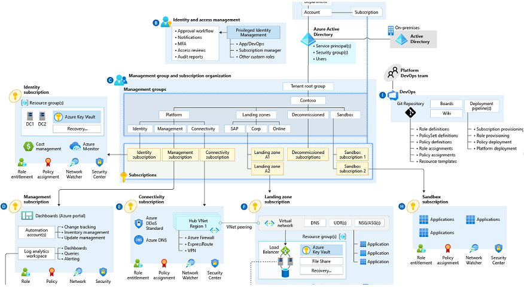

# Azure-Landing-Zones-Danmark

## Repository for a danish Azure Landing Zone accelerator

This is a landing page and is still work in progress!

This project will provide:

- a repository of *Azure Policies* to create the foundation for a compliant *Azure Landing Zone* in a Danish context using the principles of [Policy-Driven-Governance](https://learn.microsoft.com/en-gb/azure/cloud-adoption-framework/ready/landing-zone/design-principles#policy-driven-governance)
- A [Security Control Mapping Process](docs/SecurityControlMapping.md) to map every deployable *Azure Policy* back to a regulatory or organizational requirement and to ensure the mapping process has a owner

## Guiding principles

1. Stakeholder mapping: Security Control Mapping is a continuous process and requires clear organizational ownership fo Compliance Domains, Policy application, Compliance reporting and remediation.

1. All Policies mus be mapped to a requirement in the form of a Compliance domain and Control

1. *Azure Policy* must be under source control, managed using *DevOps* principals and deployed via a *CI/CD* process

1. This project builds on and is aligned to [Azure Landing Zones](https://github.com/Azure/Enterprise-Scale). The aim of this project is to provide solution accelerator for Danish Customers in regulated Industries

## Implementation options

The current repository is built using *Microsoft Bicep*

- Support for *Terraform* will be added later
- The current repository is deployed using *GitHub Actions*, support for *Azure DevOps Pipelines* will be added later

## Data Operations Section

Their is a special section discussing how data can be handled within the **Danmark ALZ** framework.

Please see the folder [DataOps](dataops/README.md)
