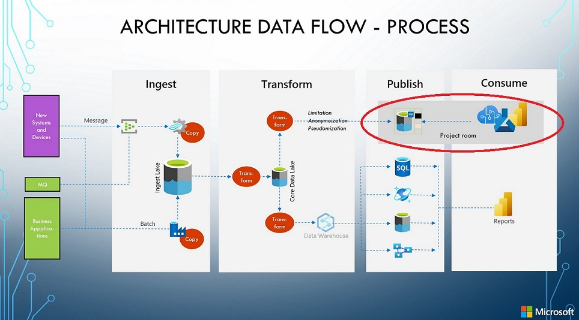

<!-- spell-checker:locale en,da-DK -->
# Azure-Landing-Zones-Danmark - DataOps

## Repository til en dansk Azure Landing Zone opsætning - **Dataops sektion**

Dette er startsiden til **DataOps**. Projektet er stadig under udarbejdelse.

Denne sektion vil indeholde følgende:

- et repository med *Azure Policies* som danner fundamentet til at oprette en *Azure Landing Zone* som tilgodeser de krav, der bør være opfyldt i dansk sammenhæng. Dette med fokus på håndtering af data.
- Guidelines i forhold til brugen af data i forskellige miljøer.
- som eksempel på et data er der brugt en *Personlig record* som indeholder CPR number, fornavn, efternavn og adresse oplysninger

## Overordnede principper

1. **GDPR** regler/principper skal tilgodeses

1. Data kan kun bruges til det formål som de er indsamlet til

1. Udvikling **kan ikke** foregå på produktions data

## Opsætnings krav

### Miljø beskrivelse

For at kunne kontrollere de enkelte poltikker og deres implementering, har vi behov for at kunne vide hvilket miljø vi er.
I dette dokument arbejder vi med følgende 4 miljøer (vi har her benyttet engelske navne):

- Sandbox – miljø som bruges til at undersøge hvor vidt funktionaliteten af en given services opfylder et givent behov.
  Disse miljøer indeholer *IKKE* forretningsdata af nogen art.
- Non-Production – indeholder miljøer til udvikling, qa og test scenarier. Disse miljøer bygger på et koncept vi kalder *projekt rum* (se nedenfor)
- Production – mijløer til brug for pre-prod og prod scenarier
- Confidential – disse miljøer benyttes til processering af data der kræver et yderligere højt sikkerheds niveau.

### Data klassification opslags “database”

En “database” hvor vi kan finde information om hvilke data elementer som kræver en speciel håndtering.
Yderligere oplysninger kan findes i kapitlet *Data Etablering*.

## Miljøer og politikker

I de forskellige miljøer er der poltikker omkring kryptering, som bør/skal etableres.

|Miljø/Politik|Sandbox|Non-Production|Production|Confidential|
|---|---|---|---|---|
|Encryption at Rest|Audit|Audit|Required|Required|
|Encryption in Transit|Audit|Audit|Required|Required|
|Encryption in Processing|N/A|N/A|N/A|Required|

- Audit – der skal være en politik der kan dokumentere hvorvidt kryptering er tilstede, selvom dette ikke er påkrævet. Dette kan benyttes til en risiko vurdering.
- Required – den politik vil **forhindre** oprettelsen af et storage lag uden krypterting.
- N/A – Ikke anvendeligt

## Miljøer og Tags ##

I den forskellige miljøer opsættes tags for lettere at kunne indetificere typen af miljøet.

|Miljø/Tag|Sandbox|Non-Production|Production|Confidential|Values|
|---|---|---|---|---|---|
|DataOwner|Audit|Required|Required|Required|*navn på data-ejer*|
|Environment|Required|Required|Required|Required|Sandbox, NonProduction, Production, Confidential|
|EnvironmentType|Required|Required|Required|Required|Sandbox: Sandbox  NonProduction: Development,Test,QualityAssurance  Production: PreProduction,Production  Confidential|

- Audit – tagget bør være der.
- Required – tagget skal være der. Hvis ikke **forhindres** oprettelsen
- N/A – Ikke anvendeligt

## Data Etablering ##

Et **Projekt rum** er et isoleret miljø - typisk en resourcegruppe - hvor ejerskabet alene er en, to eller tre AD-grupper.
Følgende viser et eksempel på hvorledes et projekt rum kunne findes i data warehouse miljø.

Det er muligt at bringe data ind i et projekt rum som er i read-only - det kræver et særskilt ejerskab og dermed AD-gruppe *"nr-2"*.

Ligeledes er det muligt at skabe en forbindelse mellem projekt rum - det kræver ejerskab af AD-gruppe *"nr-3"*.

Processen til at etablere data i et projekt rum vil bestå af en eller flere af følgende metoder:

- Kopi af produktions data
- Generering af *fake data*
- Anonymisering
- Pseudonomisering
- Kryptering + *Katalog*
- *“Ingen sammenhæng”* datasæt

Den eller de processer der skal benyttes afhænger af klassifikationen af de enkelte data elementer.

## Data etablering - mere detaljeret ##

I denne sektion ser vi på hvilke mulige teknikker der kan bruges til at etablere et eller flere datasæt i et projekt rum.
Man vil typisk bruge en kombination af disse.

**Note: Pseudomiserede data og anonymiserede data behandles forskelligt i GDPR lovginingen**

Reference [EU-dokument](https://ec.europa.eu/justice/article-29/documentation/opinion-recommendation/files/2014/wp216_en.pdf)

### Kopi af produktions data ###
I denne proces kopieres et subset af produktions data til et projekt rum. Disse datasæt er som oftest markeret som *read-only*.
*Data Factory copy pipelines* er et eksempel på en Azure service der kan bruges til dette.

### Generering af fake data ###

I denne proces dannes der *snyde(fake)* data ud fra de oplysninger man har om hvilken datatype, lændge, mønster disse passe til.
Der er **vigtig** at disse data er *reele* fake data og ikke data der gøres *fake* ved hjælp af produktions datasæt.

Oprettelse af fake datasæt er som oftest en vanskelig opgave, derfor giver det god mening at bruge tid på at denne proces har nogle om ikke alle
af disse egenskaber: kan genrbuges, er automatisk, kan skaleres og kan kaldes via parametre.

Eksempler på Python værktøjer der kan bruges til dette:
- [Faker](https://github.com/joke2k/faker)
- [SDV](https://sdv.dev/SDV/)
- [Gretel](https://synthetics.docs.gretel.ai/en/stable/#)

### Anonymisering ###

Anonymisering bruges når man kan *scramble* - typisk - et produktions datasæt og bringe det ind i et projekt rum.
Denne teknik går ud på at skabe et datasæt som ikke bruges til en "gen-identifikation" af det oprindelig data.

Selve *scramblingen* kan gøres på flere forskellig måder v.h.a. teknikker som *noise addition*, substituering, og aggregering.

Men - igen - det er meget vigtigt at en anonymisering er en "en-vejs proces", hvor man vil og skal miste mulighederne for at komme tilbage
til de oprindelige data. Ej heller må disse data kunne bruges til at "koble" sig op på andre produktions data.

*Data Factory data flows* kan bruges til dette v.h.a. udvidelsen [Microsoft Presidio](https://microsoft.github.io/presidio/).

### Pseudomisering ###

Pseudomisering er en proces lig anonymisring, men med en væsentlig forskel.
Pseudomiserede data er data da har været *udsat* for en **de-identificerings** proces som har den egenskab at,
de - om nødvendigt - kan blive **gen-identificeret**.

Tokenization og hash funktioner kan bruges til a pseudomisere data.

*Data Factory data flows* kan bruges til dette..

### Kryptering + *Dictionary* ###
I dette tilfælde beskytter man data med en krypterings nøgle som kun de personer som er i *"Kataloget"* har adgang til.
Denne nøgle opbevares typisk i en *Azure KeyVault*.

**Note:Det er ikke en valid GDPR "beskyttelse" da vi kun beskytter adgangen til data og ikke data i sig selv**

### *“Ingen sammenhæng”* datasæt ###

I denne tilgang opretter man data, der indeholder "rigtige" værdi på kolonneniveau. Så hvis man har en postnummerkolonne, så ville postnumrene være rigtige, og hvis man i samme *record* har et gadenavn, ville det også være rigtige vejnavne.

*"Ingen sammenhæng"* tilgangen kommer i spil, når man ser på data på rækkeniveau. I ovenstående tilfælde vil gadenavnet og postnummeret give mening i det virkelige liv hver for sig. Men den givne adresse (kombinationen af gadenavn og postnummer) vil ikke eksistere i det virkelige liv (fysisk).

Metoden går derfor ud på at bygge et sæt af forskellige datasæt, der repræsenterer elementer, der er for eksempel er personrelaterede fra open source-datasæt - med alle vejnavne i Danmark i ét datasæt, alle postnumre i et andet datasæt, de 20 mest almindelige fornavne i et tredje datasæt , de 20 mest brugte efternavne i et fjerde datasæt og så videre.

Og når man så opretter en ny række, skal man tilfældigt tage værdier fra disse datasæt, når man opretter et element som en "person.

*Reference til åbne datasæt:*

Danske adresser: https://dataforsyningen.dk/data/4729#data

Danske navne: https://www.dst.dk/da/Statistik/emner/borgere/navne/navne-i-hele-befolkningen
