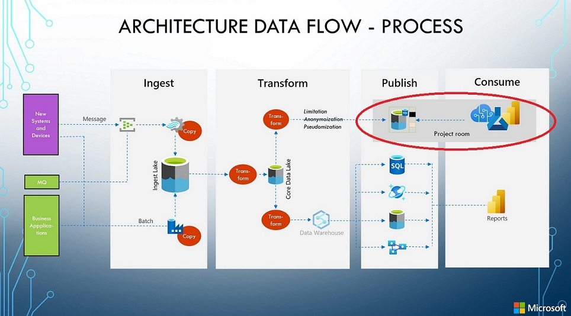

# Azure-Landing-Zones-Danmark - DataOps

## Repository for a danish Azure Landing Zone accelerator - **DataOps section**

This is a landing page for **dataops** and is still work in progress!

This part of the project will provide:

- a repository of *Azure Policies* that can be used to create the foundation for a compliant *Azure Landing Zone* with special focus of data.
- Guidelines to the usage of data within different environments.
- the data element be used as an example is a *Personal record* containing CPR number (danish personal identifier), first name, last name and address information

## Guiding principles

1. **GDPR** rules/principles must be adhered to

1. Data can only be used in the context of which they are collected

1. Development **can not** be done on production data

## Requirements

### Environment description

To control the policies, we need to know which environment we are working in. Overall, this document works with 4 environments:

- Sandbox – environment used to test functionality in a given service. These environments do NOT contain any business/company data.
- Non-Production – environments that contain development, qa and test scenarios organized in project rooms (see below)
- Production – environments supporting pre-prod and prod scenarios
- Confidential – environments supporting data processing of highly confidential data.

### Data classification lookup “database”

A “database” where we can do lookups to find out if a given asset requires special treatment – see Data Establishment.

## Environments and policies

In the different environments certain politics regarding encryption should be enforced.

|Environment/Policy|Sandbox|Non-Production|Production|Confidential|
|---|---|---|---|---|
|Encryption at Rest|Audit|Audit|Required|Required|
|Encryption in Transit|Audit|Audit|Required|Required|
|Encryption in Processing|N/A|N/A|N/A|Required|

- Audit – it is required that a policy audit if encryption is in place but does not require it. This can be used for risk-assessment.
- Required – the policy will prevent creating data storage of any kind without encryption.
- N/A – Not applicable

## Environments and Tags ##

In the different environments different tags are used to identify the nature of environment.

|Environment/Tag|Sandbox|Non-Production|Production|Confidential|Values|
|---|---|---|---|---|---|
|Data-owner|Audit|Required|Required|Required|*name of owner*|
|Environment|Required|Required|Required|Required|Sandbox, Non-Prod, Prod, Conf|
|Environment-type|N/A|Required|Required|Required|NonProd: Dev,Test,QA / Prod: PreProd,Prod|

- Audit – *tag* should be in place.
- Required – *tag* must be present, if not the deployment will be denied.
- N/A – Not applicable

## Data Establishment ##

Project room is an isolated environment with a one, two or three AD-Group ownership. The following figure shows an example of a project room in a dataplatform environment.

Possible to make data sources brought into the project room read-only, in that case the ownership is the "second AD-group"

Possible to make a integration connection between project rooms, in that case the ownership is the "third AD-group".In case

The process of bringing Data into the project room is one (or more) of the following:

- Copy of production data
- Data generation of fake data
- Anonymization
- Pseudonymization
- Encryption + *Dictionary*
- *“No relations”* datasets

The process being used will depend on the classification of the different data elements.

## Data processing in detail ##

In this section we discuss the different possibilities that you could use to establish one or more datasets in a project room.
You will most likely use a combination of these.

__Note: Pseudonymous data and anonymous data are treated differently under GDPR, the European Union data protection law__

Reference [EU-document](https://ec.europa.eu/justice/article-29/documentation/opinion-recommendation/files/2014/wp216_en.pdf)

### Copy of production data ###
In this process you copy a subset of production data to the project room. These datasets will most likely be marked as *read-only*.
An Azure service suitable for this task could be *Data Factory copy pipelines*.

### Data generation of fake data ###

In this task you will create fake data based on the information of what datatype, length, pattern your data need to adhere to.
It is **important** that this is *real* fake data and not data that is made *fake* from a production dataset.

Creating a fake data set is most often a difficult task, so it is worth making sure that the process being established has
some of the characteristics of being re-useable, automatic, scalable and parameterized.

Tools to create fake data within a Python environment.
- [Faker](https://github.com/joke2k/faker)
- [SDV](https://sdv.dev/SDV/)
- [Gretel](https://synthetics.docs.gretel.ai/en/stable/#)

### Anonymization ###
Anonymization is used when you are able to *scramble* a production dataset and bring to the project room.
Anonymous data is data that has been changed so that re-identification of the individual is impossible.

The scrambling can be done in many ways, using different technics like noise addition, substitution, and aggregation.

But - again - the important part to notice is that anonymization is a "one-way process", where you will and must loose
the ability to trace back to the original data. You must also not be able to use these data to connect and use data from
other production datasets.

*Data Factory data flows* can be used for this, with the extension of [Microsoft Presidio](https://microsoft.github.io/presidio/)

### Pseudonymization ###
Pseudonymization is bascially the same process as Anonymization, but with one big difference.
Pseudonymous data is data that has been **de-identified** from the data’s subject but can be **re-identified** as needed.

Tokenization and hash functions can be used to pseudonymize data.

*Data Factory data flows* can be used for this.

### Encryption + *Dictionary* ###
In this case you protect your data with an encryption key and only the people within the *Dictionary* of this data storage will
be able to use the key. This key could be held in an *Azure KeyVault*.

**NOTE:This is not a valid GDPR "protection" mechanism because it "only" protects the access to the data, not the data itself**

### *“No relations”* datasets ###
