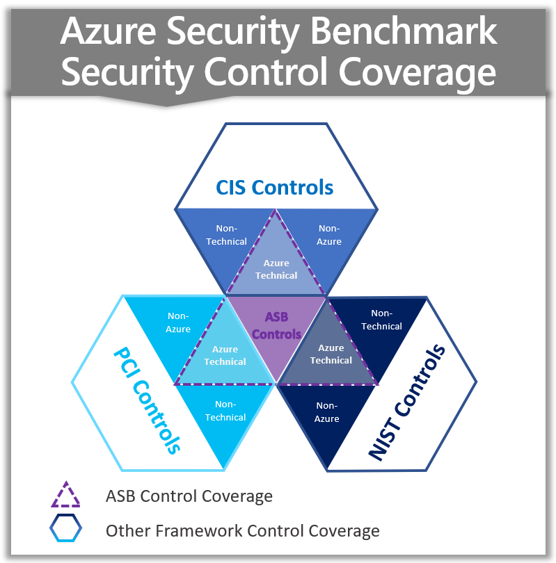
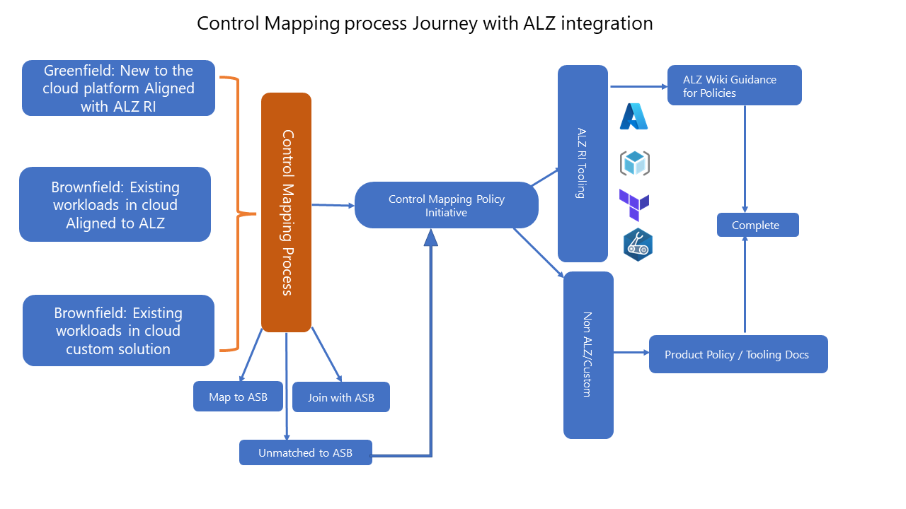
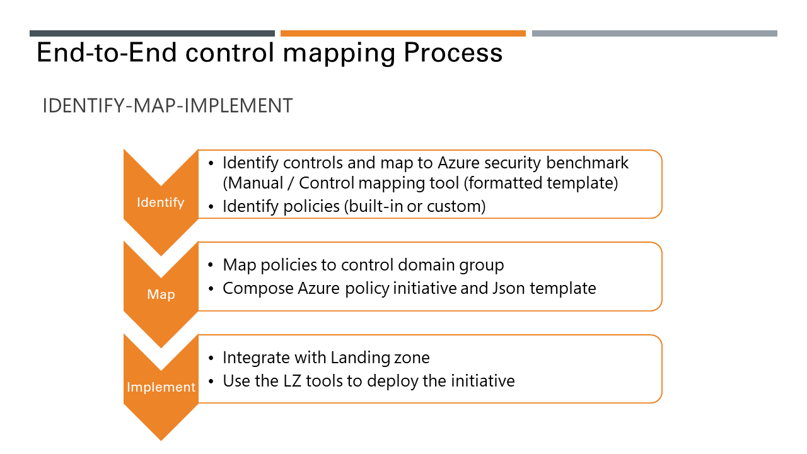

# Security Control Mapping

A detailed description of the Security Control Mapping Process can be found here: [Security control mapping with Azure landing zones - Cloud Adoption Framework](https://learn.microsoft.com/en-us/azure/cloud-adoption-framework/ready/control-mapping/security-control-mapping)

## What is Security Control Mapping and why perform it?

Many organizations are required to comply with certain industry/regional or organizational regulations before adopting and onboarding Azure cloud services.  Security Control Mapping is the process of mapping these requirements to specific Azure controls and Azure Policies or initiatives to ensure the proper compliance and reporting can be enforced.

Security Control Mapping can greatly expedite onboarding of new services into Azure by providing clarity and transparency in the form of reporting on the compliance state of individual Azure Resources and by also enforcing a given state.

The best practice recommendation is to map the required compliance controls to Azure Security Benchmark (ASB) and identify the custom set of the controls that are not covered by ASB. Azure Security Benchmark provides a canonical set of cloud-centric technical security controls based on widely used compliance control frameworks such as NIST, CIS, PCI. There are built-in regulatory compliance initiatives already available.

The best practice recommendation is to map the required compliance controls to Azure Security Benchmark (ASB) and identify the custom set of the controls that are not covered by ASB. Performing the Security Control Benchmark process will help customers identify a gap or delta of controls that are not included in ASB.

## How to perform Security Control Mapping

Compliance regulations are identified by compliance domain and controls respectively. For example, CMMC L3 AC 1.001 where AC is Access Control domain and 1.001 is a control ID in Cybersecurity Maturity Model Certification (CMMC) framework. The best practice recommendation is to map the required compliance controls to Azure Security Benchmark (ASB) and identify the custom set of the controls that are not covered by ASB.

### Control mapping steps

1. Identify the controls required.
1. Map required controls to Azure Security Benchmark.
1. Identify the controls not mapped with Azure Security Benchmark and respective policies.
1. Perform platform and service level assessment.
1. Implement guardrails with policy initiatives using Azure landing zone tooling, native tooling, or third-party tooling.

