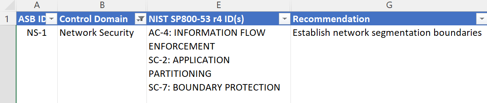
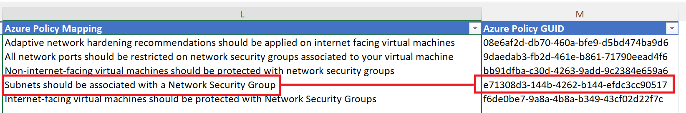
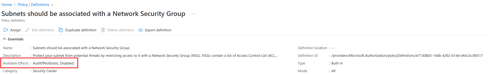
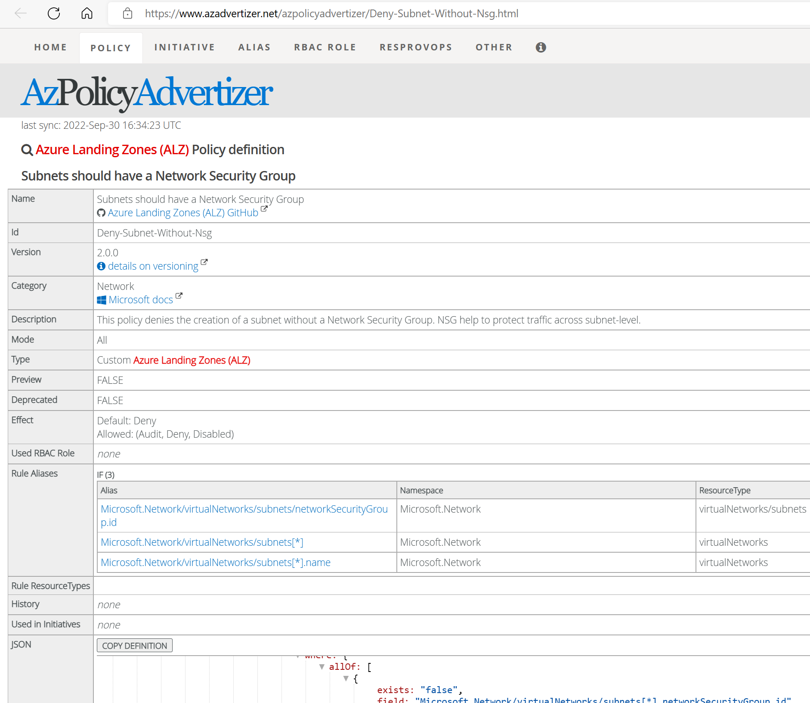

# Detailed & Step by Step instructions for the participants 

---
 
## Security Control Mapping Exercise 

---

&nbsp;
&nbsp;
 
### Background 

&nbsp;
&nbsp;

Azure Security Baseline includes "Audit Only" policies. These standards need to be mapped to enforcement policies. There are many options for existing policies to enforce the ASB controls: 

- The ASB controls map to NIST, CIS and ISO standards. These industry controls have built-in policies, some of which can "deny" and "deploy if not exists" 

- Azure Landing Zones have some [custom policies](https://github.com/Azure/Enterprise-Scale/blob/main/docs/ESLZ-Policies.md) to enforce settings via both "deny" and "deploy if not exists" 

- Sample policies exist within a [public repo](https://github.com/Azure/azure-policy) maintained by the Azure Policy product group 

- Sample policies exist within a [public repo](https://github.com/Azure/azure-policy) hosting contributions from the community 

- Azure Security Baselines exist with [Azure Security Benchmarks](https://learn.microsoft.com/en-us/security/benchmark/azure/security-baselines-overview). A baseline is a passive recommendation generated within Defender for Cloud to remind the operator to configure a setting within an Azure service to improve the security posture of the service. 

&nbsp;
&nbsp;

---

### AIM 

&nbsp;
&nbsp;

You will be split into groups and assigned one or more Compliance Domains that you will need to investigate and discuss. 

For the documented controls in your assigned Complaince Domain: 

- Document methods to convert each policy under the Azure Security Baseline v3 (ASB) from "Audit" or "AuditIfNotExists" modes to something with an enforcement in Azure. 

- identity any gaps in the documented policies that could be candidates for creating [custom azure policies](https://learn.microsoft.com/en-us/azure/governance/policy/tutorials/create-custom-policy-definition)

- There is limited time to perform this excersise, so if you get stuck on an individual control or are spending too much time on it, move on to the next one

- Once your group has finished the mapping excersise for your assigned Compliance Domain )or you run out of time) you will need to present your findings and be able to justify a) why a particular control should no longer just be in audit mode (which control requirement does it fulfill) and b) which controls are candindates for creating custom policies.

&nbsp;

---

**NOTE** : There may be more than one way to interpret the control definition text, and more than one way to implement the enforcement. 

---

&nbsp;

### Example 

&nbsp;
&nbsp;

Start with the [ASB mapping spreadsheet](../docs/Danmark-azure-security-benchmark-v3.0.xlsx) and focus on a real example from "Network Security" in ASB, NS-1 "Establish network segmentation boundaries ":

&nbsp;

&nbsp;

This compliance control in ASB lists the following Azure Policy Mappings: 

- Adaptive network hardening recommendations should be applied on internet facing virtual machines 

- All network ports should be restricted on network security groups associated to your virtual machine 

- Non-internet-facing virtual machines should be protected with network security groups 

- Subnets should be associated with a Network Security Group 

- Internet-facing virtual machines should be protected with Network Security Groups 
 

Of these 5 Azure Policies used by NS-1, we will use the 4th policy as an example: "Subnets should be associated with a Network Security Group": 

&nbsp;

&nbsp;

This seems relatively simple, but has some challenges: 

- It's ambiguous, because it states "should" and not "must". It also leads to a difficulty with the 2nd Policy where all ports should be restricted, which is too broad. 

- It's open to interpretation, e.g. If I want to use Azure Firewall to enforce port access, do I need to double-manage NSGs and the Firewall just to stay compliant. This is particularly relevant to "Online" landing zones where public access should be expected. 

- Should all new Subnets have their own NSG, or simply use a default NSG until a specific one is ready for the application 

 
You should find the best way to implement this control in a way which enforces an action in Azure, depending on your assumptions and the Landing Zone type it could be applied to. 

&nbsp;
&nbsp;

---

### Investigate 

&nbsp;
&nbsp;

Open the Azure portal, open "Policies" and search on the GUID for the policy which is noted in the [ASB Excel file](../docs/Danmark-azure-security-benchmark-v3.0.xlsx)  "e71308d3-144b-4262-b144-efdc3cc90517" 

&nbsp;

&nbsp;

We can see that the policy can either be "Disabled" (i.e. do nothing) or it can audit an event if there is a subnet without an NSG. There is NO OPTION to "Deny" or "Deploy If Not Exists". This policy is used to generate the "Health" report inside Defender for Clouds "Compliance Dashboard". 

&nbsp; 

---

**NOTE** : This output will be used in the next phase of the hackathon where we convert your comments into deployed code: 

---

&nbsp;

Investigate in [AzAdvertiser](https://www.azadvertizer.net/) if a custom policy already exists which could be used directly, or modified to be used, e.g.: 

[Subnets should have a Network Security Group (azadvertizer.net)](https://www.azadvertizer.net/)

&nbsp;

&nbsp;

There are a number of sources for policies in AzAdvertizer. When selecting a policy to use, prefer to use the following order: 

- Built-in policies 

- [Azure Landing Zones](https://github.com/Azure/Enterprise-Scale/blob/main/docs/ESLZ-Policies.md) 

- [Azure Product Group](https://github.com/Azure/azure-policy) 

- [Azure community](https://github.com/Azure/Community-Policy) 

- [Azure security baselines](https://learn.microsoft.com/en-us/security/benchmark/azure/security-baselines-overview) 

&nbsp;
&nbsp;

---

## Document your recommendations 

---

&nbsp;
&nbsp;

You are required to present your findings and proposals back for acceptance.

Add entries in the [ASB spreadsheet](../docs/Danmark-azure-security-benchmark-v3.0.xlsx) for this policy "Subnets should be associated with a Network Security Group": 

&nbsp;
&nbsp;

### "Corp" Landing Zones 

&nbsp;
&nbsp;

Use the ALZ policy located here: [Subnets should have a Network Security Group (azadvertizer.net) and set to "Deny"](https://www.azadvertizer.net/azpolicyadvertizer/Deny-Subnet-Without-Nsg.html). 

Ensure Defender for Cloud is enabled on all "Corp" + "Production" landing zone subscriptions to ensure Azure Security Baseline notifications are generated in Defender for Cloud 

&nbsp;
&nbsp;

### "Online" Landing Zones 

&nbsp;
&nbsp;

1. Create a catch-all NSG in the "Connectivity" or "Management" subscriptions. Do this once in the environment 

2. Apply an NSG rule to the catch-all allowing 80/tcp & 443/tcp inbound from the internet 

3. Use the ALZ policy located here: Subnets should have a [Network Security Group (azadvertizer.net) and set to "Deploy If Not Exists"]((https://www.azadvertizer.net/azpolicyadvertizer/Deny-Subnet-Without-Nsg.html)) where the remediation NSG is the catch-all NSG created in step 1

&nbsp;
&nbsp; 

### "Confidential" Landing Zones 

&nbsp;
&nbsp;

- Same actions as for "Corp" and "Online"  

&nbsp;
&nbsp;

### "Sandbox" Landing Zones 

&nbsp; 
&nbsp; 

- Use the built-in policy "e71308d3-144b-4262-b144-efdc3cc90517" set to "AuditIfNotExists" 

&nbsp;

---

**NOTE** : that this may cause the Compliance Dashboard to show this item as "red" if this is not remediated in the Sandbox subnet. 

---