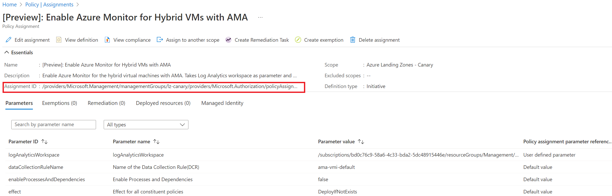
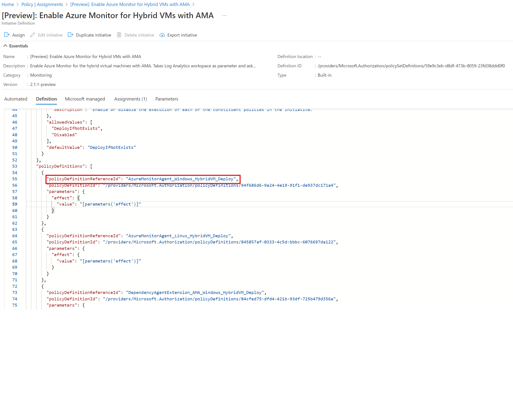

# Policy Exemptions

In order to bring Policy exemptions under source control, create a policy exemption '.json' file ('exemption_name.json') and place it in the ['Exemptions'](../../modules/Exemptions/) folder.

```json
{
    "$schema": "https://schema.management.azure.com/schemas/2019-04-01/deploymentParameters.json#",
    "contentVersion": "1.0.0.0",
    "parameters": {
        "exemptionName" : {
          "value": "Enable Azure Monitor for Hybrid VMs with AMA"
        },
        "description" : {
            "value": "Exemption for Policy Assignment: 'Enable Azure Monitor for Hybrid VMs with AMA'"
         },
        "displayName" : {
            "value": "Exemption: 'Enable Azure Monitor for Hybrid VMs with AMA'"
         },
        "policyAssignmentId" : {
            "value": "/providers/Microsoft.Management/managementGroups/lz-canary/providers/Microsoft.Authorization/policyAssignments/AMA-For-Hybrid-VMs"
         },
        "policyDefinitionReferenceIds": {
            "value":[
                "AzureMonitorAgent_Windows_HybridVM_Deploy",
                "AzureMonitorAgent_Linux_HybridVM_Deploy"
                ]
         },
        "exemptionRequestor" : {
             "value": "eamil@address.com"
        },
        "exemptionApprover" : {
            "value": "eamil@address.com"
        },
        "exemptionJustification" : {
            "value": "testing exemptions"
        }
    }
}
```

## Parameter values

---

### policyAssignmentId

The Policy Assignment ID for the exemption can be found by looking in an existing assignment:



### policyDefinitionReferenceIds

The Policy Definition reference ID can be found in the policy assignment definition in the 'policyDefinitions' section:



---

## Manual testing

To test the exemption manually, use the following powershell script:

```powershell
$parameters = @{
            templateFile            = '.\modules\shared\policyExemptions.bicep'
            templateParameterFile   = '.\modules\Exemptions\exemption-file-name.json'
            location                = 'westeurope'
            }
    #deploy Governance Rule Bicep
    New-AzDeployment @parameters -Verbose
```

### Remove un-managed Policy Exemptions

To remove any un-managed policy exemptions that have been deployed outside of this source repository, change the value of the 'removeUnmanagedExemptions' variable to 'true' in the [exemptions.yml](../../.github/workflows/exemptions.yml) file:

```yaml
env:
  MODULE_NAME: exemptions
  LOCATION: westeurope
  removeUnmanagedExemptions: false
```
